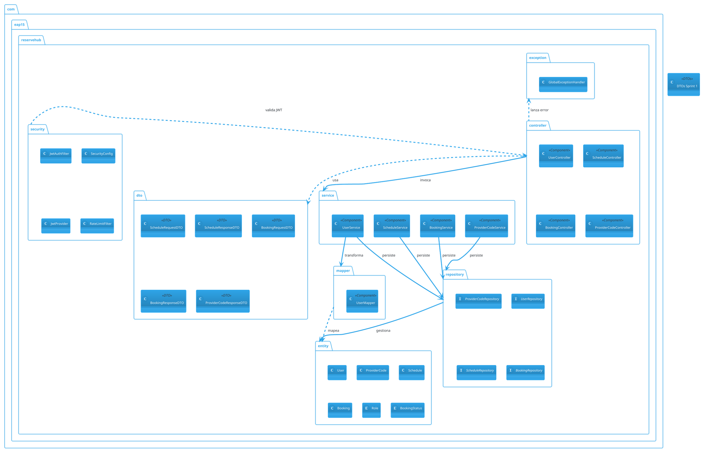

# Diagramas de Arquitectura (Sprint 1 y 2)

A continuación se presentan los diagramas de la arquitectura interna de ReserveHub. Se incluye la versión en **PlantUML** y una versión en **Texto Plano** equivalente.

---

## 1. Diagrama de Paquetes — Sprint 1 y 2 (PlantUML)



---

## 2. Diagrama de Componentes — Texto Plano

```text
========================================================================
       Diagrama de Componentes y Paquetes - ReserveHub Sprint 2
========================================================================

[ Capa de Seguridad (Spring Security / JWT) ]
  +-------------------------------------------------------------+
  | - SecurityConfig    (Define rutas y cors)                   |
  | - JwtAuthFilter     (Intercepta/Valida token JWT)           |
  | - RateLimitFilter   (Bucket4j rate-limiting por rol)        |
  | - JwtProvider       (Firma y valida el Token HS512)         |
  +-------------------------------------------------------------+
               ^ Valida peticiones HTTP (/api/**)
               | Rutas públicas: /register/**, /login, /schedules/available

[ Capa de Presentación / Controladores ]
  +-------------------------------------------------------------+
  | UserController         → /api/users                        |
  |   POST /register/cliente                                    |
  |   POST /register/proveedor                                  |
  |   POST /login                                               |
  |   GET  /                      [ADMIN]                       |
  |   GET  /{id}                  [owner | ADMIN]               |
  |   PUT  /{id}                  [owner]                       |
  |   PATCH/{id}/status           [ADMIN]                       |
  +-------------------------------------------------------------+
  +-------------------------------------------------------------+
  | ScheduleController     → /api/schedules                    |
  |   POST /                      [PROVEEDOR]                   |
  |   GET  /available             [público]                     |
  |   GET  /mine                  [PROVEEDOR]                   |
  |   PATCH/{id}/status           [PROVEEDOR]                   |
  +-------------------------------------------------------------+
  +-------------------------------------------------------------+
  | BookingController      → /api/bookings                     |
  |   POST /                      [CLIENTE]                     |
  |   GET  /mine                  [CLIENTE]                     |
  +-------------------------------------------------------------+
  +-------------------------------------------------------------+
  | ProviderCodeController → /api/provider-codes               |
  |   POST /                      [ADMIN]                       |
  |   GET  /                      [ADMIN]                       |
  |   PATCH/{id}/deactivate       [ADMIN]                       |
  +-------------------------------------------------------------+
               |  Invoca servicios
               v
[ Capa de Negocio / Servicios ]
  +---------------------+  +---------------------+
  | UserService         |  | ScheduleService     |
  |  - registerCliente  |  |  - createSchedule   |
  |  - registerProveedor|  |  - getAvailable     |
  |  - login (JWT)      |  |  - getMySchedules   |
  |  - getAllUsers       |  |  - toggleStatus     |
  |  - updateUser       |  +---------------------+
  |  - toggleStatus     |
  +---------------------+
  +---------------------+  +---------------------+
  | BookingService      |  | ProviderCodeService |
  |  - createBooking    |  |  - generateCode     |
  |  - getMyBookings    |  |  - getAllCodes       |
  |                     |  |  - deactivateCode   |
  +---------------------+  +---------------------+
               |  Transforma / Persiste
               v
[ Capa de Repositorios ]
  +----------------+  +--------------------+
  | UserRepository |  | ScheduleRepository |
  +----------------+  +--------------------+
  +------------------+  +---------------------+
  | BookingRepository|  | ProviderCodeRepo    |
  +------------------+  +---------------------+
               |
               v
[ Capa de Dominio / Entidades ]
  +---------+  +-------------+  +----------+  +---------+
  | User    |  | ProviderCode|  | Schedule |  | Booking |
  | Role    |  | (active,    |  |          |  | Status  |
  +---------+  |  used)      |  +----------+  +---------+
               +-------------+
               |
               v
  +--------------------------------------------+
  |  Base de Datos (PostgreSQL en Supabase)    |
  |  Tablas: users, provider_codes,            |
  |           schedules, bookings              |
  +--------------------------------------------+
```

---

## 3. Diagrama Entidad-Relación (ER)

```text
users
 ├── id (PK)
 ├── first_name, last_name, email, password, phone
 ├── service_type, service_description  [solo PROVEEDOR]
 ├── role (CLIENTE | PROVEEDOR | ADMINISTRADOR)
 └── active

provider_codes
 ├── id (PK)
 ├── code (UNIQUE)
 ├── used
 └── active

schedules
 ├── id (PK)
 ├── provider_id (FK → users.id)
 ├── start_time, end_time
 ├── available_slots
 ├── active
 └── created_at

bookings
 ├── id (PK)
 ├── client_id (FK → users.id)
 ├── schedule_id (FK → schedules.id)
 ├── status (CONFIRMED | CANCELLED)
 └── created_at

Relaciones:
  users (1) ──< schedules (N)   [un proveedor tiene muchas franjas]
  users (1) ──< bookings  (N)   [un cliente hace muchas reservas]
  schedules (1) ──< bookings (N) [una franja tiene muchas reservas]
```

---

## 4. Flujo de Reserva (HU-06 → HU-07 → HU-08)

```text
[PROVEEDOR]                    [CLIENTE]                    [ADMIN]
     |                              |                           |
     | POST /api/schedules          |                           |
     |  {startTime, endTime,        |                           |
     |   availableSlots}            |                           |
     |──────────────────►           |                           |
     |                  Valida rango y traslapes                |
     |◄──────────────── 200 OK {franja creada}                  |
     |                              |                           |
     |                  GET /api/schedules/available            |
     |                  ?providerId=X&date=YYYY-MM-DD           |
     |                 ◄────────────|                           |
     |                  [lista de franjas activas con cupos]    |
     |                  ─────────────►                          |
     |                              |                           |
     |                  POST /api/bookings                      |
     |                  {scheduleId: X}                         |
     |                 ◄────────────|                           |
     |                  Valida cupo → decrementa               |
     |                  ─────────────►                          |
     |                  200 OK {reserva confirmada}             |
     |                              |                           |
     |                              |  POST /api/provider-codes |
     |                              |  ◄────────────────────────|
     |                              |  200 OK {PROV-XXXXXXXX}   |
     |                              |  ──────────────────────►  |
```
