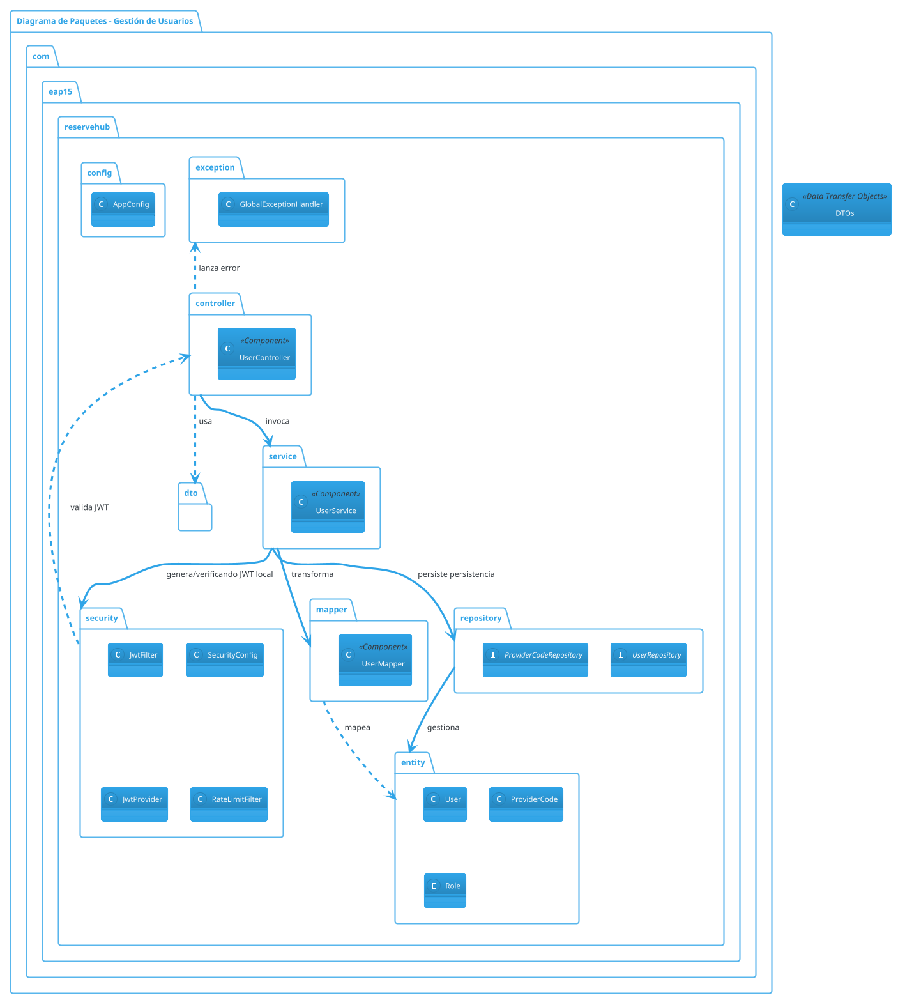

# Diagramas de Arquitectura (Sprint 1 y 2 - Épicas 1 y 2)

A continuación se presentan los diagramas de la arquitectura interna de ReserveHub. Como se solicitó, se incluye la versión en **PlantUML** y una versión en **Texto Plano** equivalente.

---

## 1. Versión en PlantUML

Puedes copiar este bloque y pegarlo en cualquier visualizador de PlantUML (como la extensión de VSCode del mismo nombre o plantuml.com).



---

## 2. Versión en Texto Plano (Jerárquica / ASCII)

```text
========================================================================
             Diagrama de Componentes y Paquetes - ReserveHub            
========================================================================

[ Capa de Presentación / Controladores ]
  +---------------------------------------------+
  |  UserController (POST /login, GET /profile) |
  +---------------------------------------------+
               |                  ^
               | Usa              | Lanza Exception
               v                  |
  +---------------------------------------------+
  |               Capa de DTOs                  |
  |  (LoginRequestDTO, UserDTO, ProviderDTO)    |
  +---------------------------------------------+

[ Capa de Seguridad (Spring Security / JWT) ]
  +---------------------------------------------+
  | - SecurityConfig    (Define rutas y cors)   |
  | - JwtAuthFilter     (Intercepta/Valida token|
  | - RateLimitFilter   (Bucket4j rate-limiting)|
  | - JwtProvider       (Firma el Token)        |
  +---------------------------------------------+
               ^ Valida peticiones HTTP
               | (Cualquier endpoint /api/**)

[ Capa de Negocio / Servicios ]
  +---------------------------------------------+
  | UserService                                 |
  |  - Valida BCrypt                            |
  |  - Aplica lógicas (HU-01, HU-02)            |
  |  - Genera JWT invocando al JwtProvider      |
  +---------------------------------------------+
               |                    |
   Transforma  |                    | Persistencia
               v                    v
  +----------------+    +-----------------------+
  |  UserMapper    |    |   UserRepository      |
  | (DTO <-> Entity|    | ProviderCodeRepository|
  +----------------+    +-----------------------+
               |                    |
       Mapea   |                    | Gestiona
               v                    v
[ Capa de Dominio / Entidades ]
  +---------------------------------------------+
  | - User (Incluido 'Role', 'serviceDesc...')  |
  | - ProviderCode                              |
  +---------------------------------------------+
                          |
                      (Lee/Escribe)
                          v
         +----------------------------------+
         | Base de Datos (PostgreSQL en     |
         | Supabase)                        |
         +----------------------------------+
```
